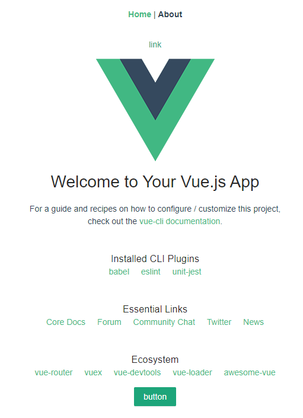

# antd-demo1

## 初始化项目

``` js
vue create [projectName] 

 以下位生成项目配置的选项列：按空格为选中，回车为确定到下一步：
  //选择特性
  Manually select features：
  Babel、Router、Vuex、CSS Pre-processors、Linter/Formatter、Unit Testing  

  //是否用history的路由
  use hisotry mode ： y

  //选择css预加载器
  pick a Css pre-processor ：Less

  //选择代码检查和美化器
  pick a linter/formatter : Eslint + Prettier  

  //选择额外的代码检查特性
  pick additional lint features:
  Lint on save、Lint and fix on commit

  //选择单元测试
  pick a unit testing：
  Jest

  //是否选择单独的配置文件放配置而不是都放入package.json
  where do you prefer placing config for Babel，PostCSS：
  In decicated config files

  //是否保存预设值给将来使用
  Save this as a preset for future projects：
  y

  //保存配置为什么名字
  save preset as：
  [projectName]

cd [projectName]

yarn serve
```
执行上述命令 你会得到一个名为[projectName]的名字和一个名为[projectName]的自定义配置，当你下次执行``` vue create [projectName] ``` 的时候，你可以选择自己定义的配置。

### 基础配置和包的引入
首先引入 [ant-design-vue](https://www.antdv.com/docs/vue/use-with-vue-cli-cn/) (点击链接查看官方教程~)

#### 配置自定义主题
在根目录建立 ***vue.config.js*** 文件，键入以下代码
``` js
module.exports = {
  css: {
    loaderOptions: {
      less: {
        modifyVars: {
          "primary-color": "#1DA57A",
          "link-color": "#1DA57A",
          "border-radius-base": "2px"
        },
        javascriptEnabled: true
      }
    }
  }
};

```
执行 ``` yarn serve ```，可能会报下面的错误
<font color="red"> Module not found: Error: Can't resolve 'less-loader'</font>
那么，就需要安装LESS插件提供对less的支持，执行 ``` yarn add less less-loader ``` ，然后就可以使用了，比如在home.vue文件里加入一个按钮 
```html
<a-button type="primary">button</a-button>
```
启动项目后，可以看到成功引入了 ***ant-design-vue*** 并且修改了主题颜色


### 依赖包
axios、mock、moment、vue-ls（vue本地存储）、Viser（图表）、vue-clipboard2（剪切板）
———————————————————————————————
## Project setup
```
yarn install
```

### Compiles and hot-reloads for development
```
yarn run serve
```

### Compiles and minifies for production
```
yarn run build
```

### Run your tests
```
yarn run test
```

### Lints and fixes files
```
yarn run lint
```

### Run your unit tests
```
yarn run test:unit
```

### Customize configuration
See [Configuration Reference](https://cli.vuejs.org/config/).
